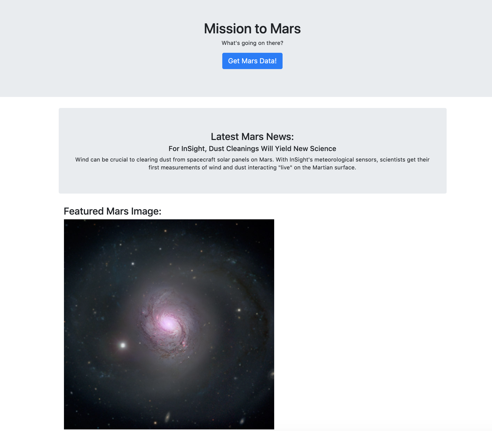
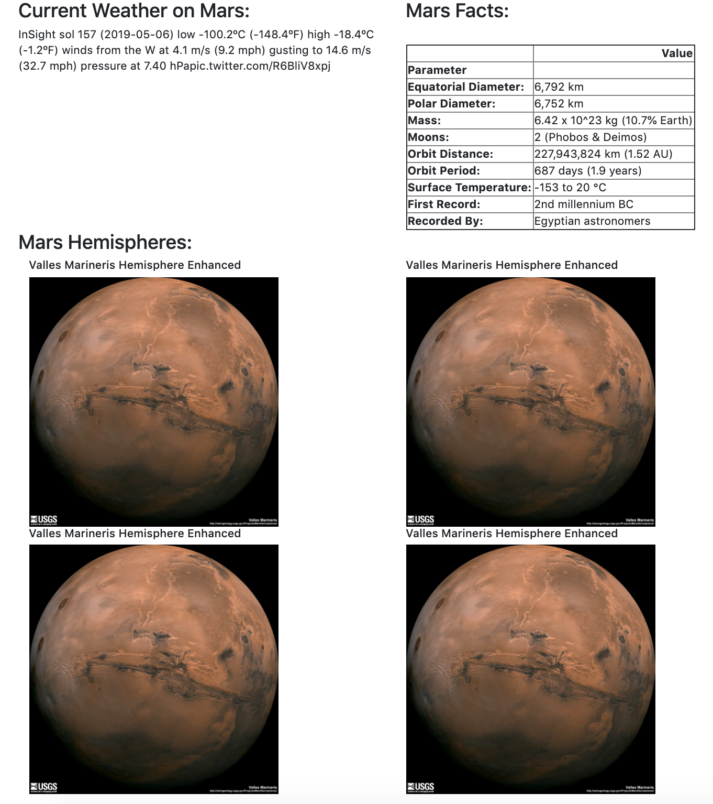

# WebScraping-Mission_to_Mars

A web application is built that scrapes various websites for data related to the Mission to Mars and displays the information in a single HTML page.

**Scraping:**
Web scraping is documented in `Mission_to_Mars.ipynb`, tools used include BeautifulSoup, Pandas, and Requests/Splinter. Data are scraped from:
1. [NASA Mars News Site](https://mars.nasa.gov/news/) for latest news title and paragraph.
2. [JPL Featured Space Image](https://www.jpl.nasa.gov/spaceimages/?search=&category=Mars) for current featured mars image. 
3. [Mars Weather Twitter Account](https://twitter.com/marswxreport?lang=en) for latest Mars weather tweet.
4. [Mars Facts](https://space-facts.com/mars/) for Mars facts. Pandas is used to scrape the table, data converted to a HTML table string.
5. [USGS Astrogeology Site](https://astrogeology.usgs.gov/search/results?q=hemisphere+enhanced&k1=target&v1=Mars) to obtain high resolution images for each of Mar's hemispheres.

**MongoDB and Flask Application:**
MongoDB with Flask templating was used to create a new HTML page that displays all of the information that was scraped from the URLs above.

Screen shots of final product:

